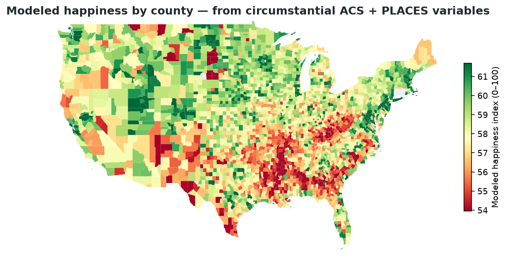
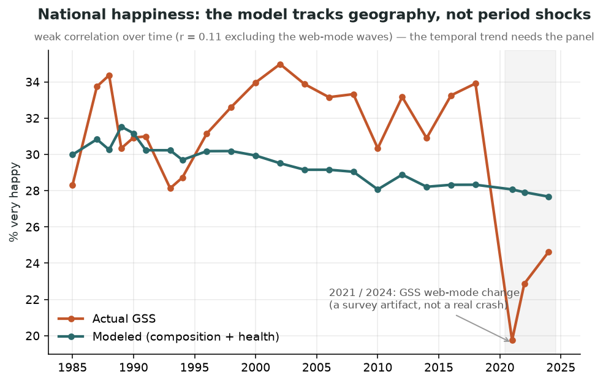

# microhappiness 🙂

**A modeled happiness number for every neighborhood in America.** microhappiness estimates subjective
happiness for every US census tract and ZIP — and, by aggregation, any ward, neighborhood, or county —
by fitting the **GSS happiness question** on circumstantial demographics and poststratifying onto
**ACS** + **CDC PLACES** data. It's the [CDC PLACES](https://www.cdc.gov/places/methodology/index.html)
method (multilevel regression + poststratification) pointed at wellbeing instead of health.



> ⚠️ **Synthetic estimates, not measurements.** Each value is the happiness *expected* given an area's
> **circumstantial ACS and PLACES variables** — income, marital/household status, employment, home
> ownership, and health — with immutable identity variables (age, sex, race) deliberately excluded. Most
> of what drives happiness (personality, faith, social ties) isn't in the data, so these estimates are
> smooth and composition-driven. We measure that ceiling honestly before trusting any output. Read
> [METHODOLOGY.md](METHODOLOGY.md) and [METHODOLOGY_TODO.md](METHODOLOGY_TODO.md).

## What it produces

A nationwide table — **78,600 census tracts + 29,579 ZCTAs** — with, per area:

| column | meaning |
|---|---|
| `happiness_index` | modeled happiness, 0–100 |
| `pct_very_happy` | modeled share "very happy" |
| `*_lo` / `*_hi` | 90% confidence interval (coefficient uncertainty; a lower bound) |
| `adult_pop` | adult population (the aggregation weight) |

…plus a `byop/v1` `aggregation_spec.json` so any consumer can roll the per-area values up to its own
polygons. This drives the **Modeled happiness** metric live in [Ward Wise Penlight](https://penlight.wardwise.org).

## How it works

```
GSS happiness  ──fit──►  model (circumstance + health, identity-free)
                                    │ poststratify (rake the GSS seed
ACS margins  ───────────────────────┤  onto each area's published margins)
CDC PLACES health margin  ──────────┘
                                    ▼
              tract / ZCTA happiness  ──population-weighted──►  any polygons
```

1. **Fit** a small, transparent model of GSS `HAPPY` on **circumstantial** predictors only — income,
   marital/household status, employment, home ownership, living-alone — plus a **health** margin from
   CDC PLACES (the strongest predictor the ACS can't supply). Identity (age/sex/race) is excluded so the
   estimate rewards changeable conditions, not who lives there. Candidate specs in
   [`models.py`](microhappiness/models.py); the predictor screen is in `diagnostics/`.
2. **Poststratify** by raking the national GSS joint onto each area's ACS + PLACES marginals.
3. **Predict + aggregate** to the nationwide tract/ZCTA table, then population-weight up to any polygons.
4. **Calibrate** the national level to the GSS rate, attach **confidence intervals**, and **validate**.

## Validation

- **National level — exact.** After calibration the population-weighted national rate matches the
  design-weighted GSS rate (31.0% very-happy / index 58.9, gap 0.0).
- **Geography — sensible.** Highest counties cluster in the Upper Midwest/Plains, lowest in the
  South/Appalachia (the map above); within Chicago, affluent wards rank highest, the most disadvantaged
  lowest.
- **Convergent validity — r ≈ −0.28** against CDC PLACES diagnosed depression (deliberately *reserved*
  from the model) across 78.6k tracts.
- **National trend — and why there's no temporal forecast.** A *cross-sectional* model tracks geography,
  not time (real year-to-year **r ≈ 0.11**; the apparent 0.36 is inflated by the 2021/2024 GSS web-mode
  artifact). We tried a period model — it fits in-sample (r ≈ 0.81) but **overfits**: leave-one-year-out
  collapses to r ≈ 0.20. National happiness *mood* is idiosyncratic period shock, not a forecastable
  trend, so the honest product is the **spatial** estimate. (Details + chart in
  [METHODOLOGY_TODO.md](METHODOLOGY_TODO.md).)



## Use it

**Build the estimates** (needs a free [Census API key](https://api.census.gov/data/key_signup.html)
and the [GSS cumulative datafile](https://gss.norc.org/get-the-data) at `data/gss_cumulative.dta`):

```bash
pip install -e .
export CENSUS_API_KEY=...
python -m diagnostics.step0_variance_ceiling                 # the honesty gate (measure the ceiling)
python -m microhappiness.run --geography tract --out-dir data/national   # nationwide tracts
python -m microhappiness.run --geography zcta  --out-dir data/national   # nationwide ZCTAs
python -m diagnostics.make_visuals                           # regenerate the README visuals
```

**Consume the published artifact** (no need to run the model). Read `data/national/happiness_<geo>.csv`
+ `aggregation_spec.json` and population-weight the values onto your polygons. A reference consumer
(`polygon_values` / `weighted_mean`) lives in ward-wise-civic-tech's `pipelines/civic_data/byop.py`.

## For collaborators (e.g. Columbus)

Nothing here is Chicago-specific — the table is nationwide. Point it at your city's tract geometries and
aggregate. Consume the **published artifact**, so you never import this repo's modeling stack.

## Layout

```
microhappiness/   gss · acs · places · binning · poststratify · estimate · calibrate · validate · publish · run
diagnostics/      step0_variance_ceiling · step1_screen · full_screen · make_visuals
```

## License / data

Public. GSS data © NORC (cumulative datafile, public use); ACS via the Census API; CDC PLACES public.
Estimates are modeled — cite [METHODOLOGY.md](METHODOLOGY.md) and the synthetic-estimate caveat in any
downstream use.
